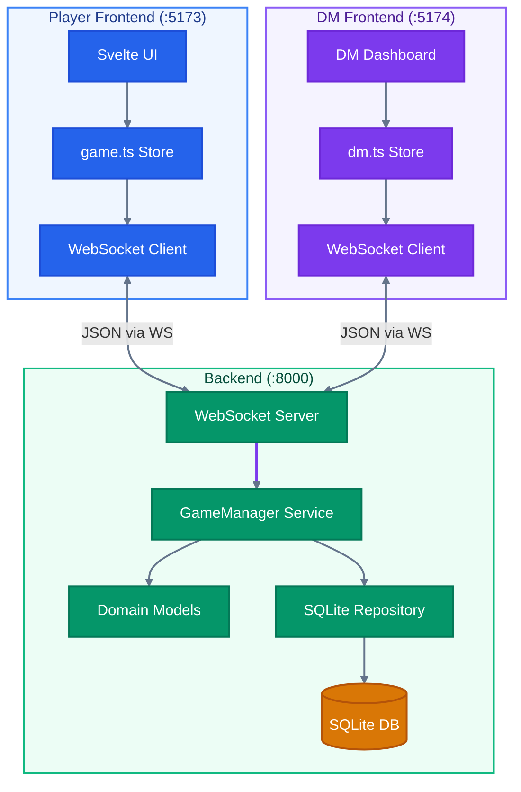
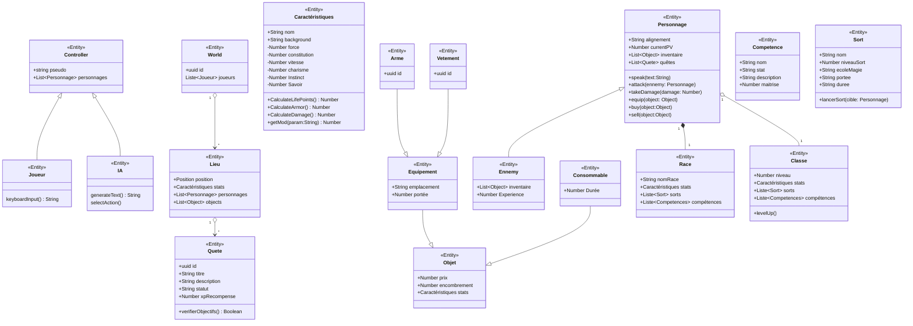

# D&D - Async Tabletop RPG Engine (Go & Svelte Edition)

A multiplayer, asynchronous, ultra-lightweight tabletop RPG (TTRPG) platform. The backend is built in **Go** with WebSockets and **SQLite** persistence. The player client is a reactive **Svelte 4** app with **TypeScript**, powered by **Vite**, and a dedicated **Dungeon Master panel** (`dm-frontend`) lets a GM administer the whole world in real time.

The platform manages real-time virtual tabletop sessions: player movement, physical and magic combat, inventory management, NPC management, location exploration, and instant event logging.

---

## Architecture Overview

The project follows a clean modular architecture with strict separation between domain, services, and persistence. Two frontends connect to the same backend: the player client and the Dungeon Master admin panel.

### Project Structure
```
/
├── backend/                    # Go game server
│   ├── go.mod                  # Module & dependencies (SQLite, Gorilla WebSocket)
│   ├── cmd/
│   │   └── server/
│   │       └── main.go         # Entry point, Dependency Injection
│   └── internal/
│       ├── domain/             # Pure business logic (Models)
│       │   └── models.go       # Character, Stats, Item, Spell, World, NPC...
│       ├── repository/         # Data layer (Persistence)
│       │   └── sqlite_repo.go  # SQLite operations (Save/Get/Delete Character)
│       └── services/           # Orchestration logic
│           └── game_manager.go # WebSocket management, Combat, Sync, DM actions
│
├── frontend/                   # Player web app (Svelte + TypeScript)
│   ├── src/
│   │   ├── lib/
│   │   │   ├── components/     # Atomic Design (Atoms, Molecules, Organisms)
│   │   │   │   ├── atoms/      # Button, HPBar, Input, StatLabel
│   │   │   │   ├── molecules/  # CharacterSheet, InventoryItem, LootItem
│   │   │   │   └── organisms/  # ChatBox, LocationExplorer, LoginPage, GamePage
│   │   │   └── stores/
│   │   │       └── game.ts     # Global store & WebSocket communication (TypeScript)
│   │   └── routes/
│   │       └── +page.svelte    # Main route
│   ├── app.css                 # Tailwind config, D&D theme, animations
│   └── index.html              # SPA entry point
│
└── dm-frontend/                # Dungeon Master admin panel (Svelte + TypeScript)
    ├── src/
    │   ├── lib/
    │   │   ├── components/     # DM-specific editors
    │   │   │   ├── StatsEditor.svelte       # Edit stats & HP
    │   │   │   ├── InventoryEditor.svelte   # Add/remove inventory items
    │   │   │   ├── SpellEditor.svelte       # Add/remove spells
    │   │   │   ├── LocationManager.svelte   # Edit locations & loot
    │   │   │   ├── NPCManager.svelte        # Create/edit/delete NPCs
    │   │   │   └── ChatBox.svelte           # Event journal
    │   │   └── stores/
    │   │       └── dm.ts       # DM store & WebSocket communication (TypeScript)
    │   └── routes/
    │       └── +page.svelte    # Login + dashboard (roster / editor / world)
    └── index.html              # SPA entry point
```

### Data Flow


---

## Installation & Setup

### 1. Backend (Go)
Requires Go installed.
```bash
cd backend
go run cmd/server/main.go
```
Server starts on `:8000`. The `game.db` SQLite database is created automatically.

### 2. Player Frontend (Svelte + TypeScript)
Requires Node.js or Bun.
```bash
cd frontend
npm install    # or bun install
npm run dev    # or bun run dev
```
Access at **`http://localhost:5173`**.

### 3. Dungeon Master Panel (Svelte + TypeScript)
```bash
cd dm-frontend
npm install
npm run dev
```
Access at **`http://localhost:5174`**. Connect with the pseudo **`dm`** (any pseudo starting with `dm_` also gets admin rights).

### Build
```bash
cd frontend
npm run build            # Production build
cd ../dm-frontend
npm run build            # Production build
```

---

## WebSocket Protocol

All actions are transmitted as JSON objects. The player pseudo from the URL identifies the player; pseudos `dm` / `dm_*` are treated as Dungeon Masters and unlock the admin actions below.

### Client -> Server Actions (Players)
* **Init (`type: "init"`)**: Sends character name and class. The server uses the URL pseudo to restore existing stats if the player already exists.
* **Move (`type: "move"`)**: `{"type": "move", "destination": "Donjon"}`
* **Attack (`type: "attack"`)**: `{"type": "attack", "cible": "Pseudo"}`
* **Spell (`type: "cast_spell"`)**: `{"type": "cast_spell", "sort": "Nom", "cible": "Pseudo"}`
* **Consumable (`type: "use_consumable"`)**: `{"type": "use_consumable", "item_name": "Potion de Soin"}`
* **Loot (`type: "loot"`)**: `{"type": "loot", "loot_name": "Objet"}`

### Client -> Server Actions (Dungeon Master)
| Action | Payload | Description |
|---|---|---|
| `dm_edit_stats` | `target_player`, `stats` | Overwrite a player's 6 stats |
| `dm_set_pv` | `target_player`, `pv` | Force a player's current HP |
| `dm_add_item` / `dm_remove_item` | `target_player`, `item` / `item_index` | Grant or take inventory items |
| `dm_add_spell` / `dm_remove_spell` | `target_player`, `spell` / `item_index` | Grant or remove spells |
| `dm_move_player` | `target_player`, `destination` | Teleport a player to any location |
| `dm_edit_align` | `target_player`, `alignement` | Change a player's alignment |
| `dm_delete_player` | `target_player` | Remove a player from the world & DB |
| `dm_edit_location` | `destination`, `new_name`, `location_bg` | Rename / re-describe a location (also updates players & NPCs there) |
| `dm_teleport_item_add` / `dm_teleport_item_remove` | `destination`, `item` / `item_index` | Add/remove loot on the ground |
| `dm_add_npc` / `dm_remove_npc` | `item_name`, `destination`, `pv`, `alignement` | Create / delete an NPC |
| `dm_edit_npc` | `item_name`, `stats`, `pv`, `alignement` | Edit an NPC (0 values are skipped) |
| `dm_move_npc` | `item_name`, `destination` | Move an NPC |
| `dm_npc_add_item` / `dm_npc_remove_item` | `item_name`, `item` / `item_index` | Manage NPC inventory |
| `dm_npc_add_spell` / `dm_npc_remove_spell` | `item_name`, `spell` / `item_index` | Manage NPC spells |

### Server -> Client Events
1. **Chat (`type: "chat"`)**: Broadcasts game events to all players.
2. **Sync (`type: "sync"`)**: Full state of all players, NPCs and locations. Includes `liste` (players), `npcs`, and `locations`.

---

## Game Engine Rules

* **Max HP**: Constitution x 10.0
* **Physical Damage**: Force x 2.0
* **Armor**: Vitesse x 1.5
* **Combat**: Damage = Attacker Damage - Target Armor (minimum 1.0)
* **Persistence**: Characters are saved to SQLite after every action
* **Death**: Falling to 0 HP resurrects at the Taverne at full HP
* **NPCs**: Managed by the DM only; NPCs are broadcast to players who see them at their current location

---

## Frontend Features

### Player Frontend
* **HP Bar**: Videogame-style health bar with instant green fill, red damage trail that catches up slowly, and a red flash on hit. Pulses red when health drops below 25%.
* **Atomic Design**: Component architecture split into Atoms (Button, HPBar, Input, StatLabel), Molecules (CharacterSheet, InventoryItem, LootItem), and Organisms (ChatBox, LocationExplorer, LoginPage, GamePage).
* **Responsive Layout**: Sticky sidebar on desktop, tab-based navigation on mobile.
* **Chat Log**: Parchment-styled event journal with numbered entries and auto-scroll.
* **Class Selection**: Visual card-based class picker (Guerrier, Magicien, Voleur, Clerc, Barde, Ranger).
* **Form Validation**: Real-time validation with error states on the login form.
* **NPC Display**: NPCs present at the player's location are shown with their HP bar.

### Dungeon Master Panel
* **Roster**: All connected adventurers with live HP and location, click to edit.
* **Full Character Editor**: Stats, HP, alignment, location teleport, inventory, spells.
* **NPC Manager**: Create, edit stats, move, equip inventory, assign spells, and delete NPCs.
* **Location Manager**: Rename locations, edit descriptions, add/remove ground loot, see who's present.
* **Event Journal**: Live chat log of every DM action broadcast to the world.

---

## Domain Model


