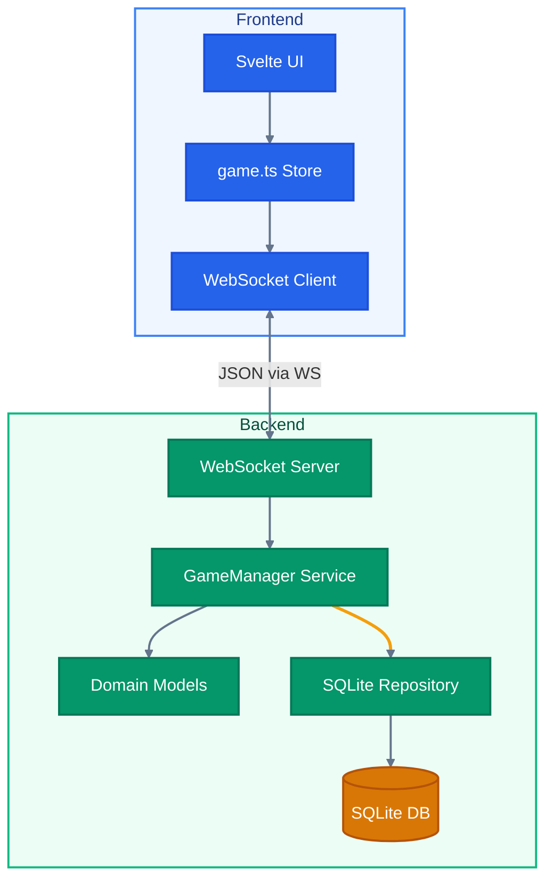
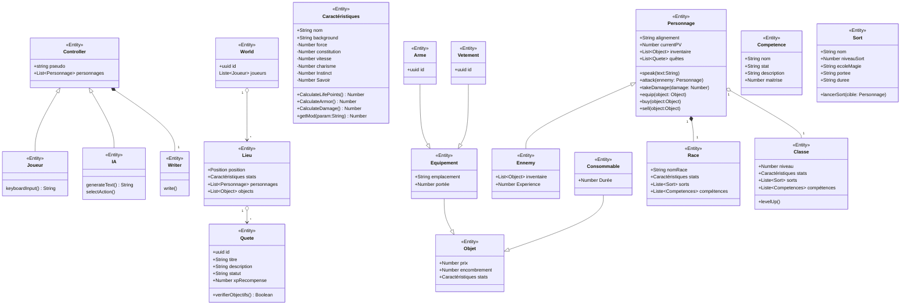

# D&D - Async Tabletop RPG Engine (Go & Svelte Edition)

A multiplayer, asynchronous, ultra-lightweight tabletop RPG (TTRPG) platform. The backend is built in **Go** with WebSockets and **SQLite** persistence. The frontend is a reactive **Svelte 4** app with **TypeScript**, powered by **Vite**.

The platform manages real-time virtual tabletop sessions: player movement, physical and magic combat, inventory management, location exploration, and instant event logging.

---

## Architecture Overview

The project follows a clean modular architecture with strict separation between domain, services, and persistence:

### Project Structure
```
/
├── backend/                    # Go game server
│   ├── go.mod                  # Module & dependencies (SQLite, Gorilla WebSocket)
│   ├── cmd/
│   │   └── server/
│   │       └── main.go         # Entry point, Dependency Injection
│   └── internal/
│       ├── domain/             # Pure business logic (Models)
│       │   └── models.go       # Character, Stats, Item, Spell, World...
│       ├── repository/         # Data layer (Persistence)
│       │   └── sqlite_repo.go  # SQLite operations (Save/Get Character)
│       └── services/           # Orchestration logic
│           └── game_manager.go # WebSocket management, Combat, Sync
│
└── frontend/                   # Svelte + TypeScript web app
    ├── src/
    │   ├── lib/
    │   │   ├── components/     # Atomic Design (Atoms, Molecules, Organisms)
    │   │   │   ├── atoms/      # Button, HPBar, Input, StatLabel
    │   │   │   ├── molecules/  # CharacterSheet, InventoryItem, LootItem
    │   │   │   └── organisms/  # ChatBox, LocationExplorer, pages/
    │   │   └── stores/
    │   │       └── game.ts     # Global store & WebSocket communication (TypeScript)
    │   └── routes/
    │       └── +page.svelte    # Main route
    ├── app.css                 # Tailwind config, D&D theme, animations
    └── index.html              # SPA entry point
```

### Data Flow


---

## Installation & Setup

### 1. Backend (Go)
Requires Go installed.
```bash
cd backend
go run cmd/server/main.go
```
Server starts on `:8000`. The `game.db` SQLite database is created automatically.

### 2. Frontend (Svelte + TypeScript)
Requires Node.js or Bun.
```bash
cd frontend
npm install    # or bun install
npm run dev    # or bun run dev
```
Access at **`http://localhost:5173`**.

### Build
```bash
cd frontend
npm run build       # Production build
npm run check       # Type-check with svelte-check
```

---

## WebSocket Protocol

All actions are transmitted as JSON objects.

### Client -> Server Actions
* **Init (`type: "init"`)**: Sends character name and class. The server uses the URL pseudo to restore existing stats if the player already exists.
* **Move (`type: "move"`)**: `{"type": "move", "destination": "Donjon"}`
* **Attack (`type: "attack"`)**: `{"type": "attack", "cible": "Pseudo"}`
* **Spell (`type: "cast_spell"`)**: `{"type": "cast_spell", "sort": "Nom", "cible": "Pseudo"}`
* **Consumable (`type: "use_consumable"`)**: `{"type": "use_consumable", "item_index": 0}`
* **Loot (`type: "loot"`)**: `{"type": "loot", "loot_index": 0}`

### Server -> Client Events
1. **Chat (`type: "chat"`)**: Broadcasts game events to all players.
2. **Sync (`type: "sync"`)**: Full state of all players and locations.

---

## Game Engine Rules

* **Max HP**: Constitution x 10.0
* **Physical Damage**: Force x 2.0
* **Armor**: Vitesse x 1.5
* **Combat**: Damage = Attacker Damage - Target Armor (minimum 1.0)
* **Persistence**: Characters are saved to SQLite after every action

---

## Frontend Features

* **HP Bar**: Videogame-style health bar with instant green fill, red damage trail that catches up slowly, and a red flash on hit. Pulses red when health drops below 25%.
* **Atomic Design**: Component architecture split into Atoms (Button, HPBar, Input, StatLabel), Molecules (CharacterSheet, InventoryItem, LootItem), and Organisms (ChatBox, LocationExplorer, LoginPage, GamePage).
* **Responsive Layout**: Sticky sidebar on desktop, tab-based navigation on mobile.
* **Chat Log**: Parchment-styled event journal with numbered entries and auto-scroll.
* **Class Selection**: Visual card-based class picker (Guerrier / Magicien) instead of a raw dropdown.
* **Form Validation**: Real-time validation with error states on the login form.

---

## Domain Model


