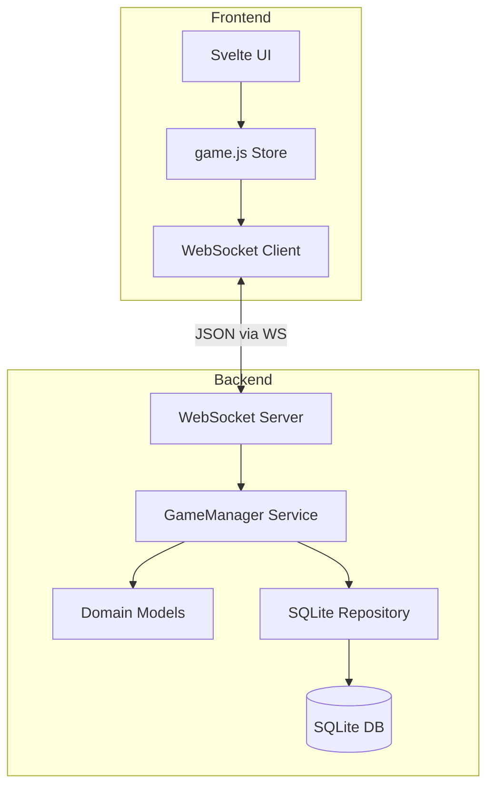
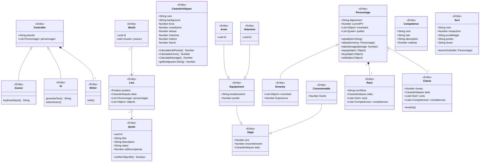

# ⚔️ D&D - Async Tabletop RPG Engine (Go & Svelte Edition)

Une architecture de jeu de rôle sur table (JDR) multijoueur, asynchrone et ultra-légère. Ce projet comprend un backend performant développé en **Go** avec des WebSockets et une persistance **SQLite**, et un frontend réactif en **Svelte 4** propulsé par **Bun** et **Vite**.

Cette plateforme permet de gérer en temps réel une session de table virtuelle : positionnement tactique, suivi des combats physiques et magiques, gestion de l'inventaire et journalisation instantanée (chat).

---

## 🧭 Vue d'ensemble de l'Architecture

Le projet suit une architecture modulaire avec une séparation nette entre le domaine, les services et la persistance :

### 🛠️ Structure du Code
```
/
├── backend/                # Serveur de jeu en Go
│   ├── go.mod              # Module Go & dépendances (SQLite, Gorilla WebSocket)
│   ├── cmd/
│   │   └── server/
│   │       └── main.go     # Point d'entrée, Injection de Dépendances (DI)
│   └── internal/
│       ├── domain/         # Logique métier pure (Models)
│       │   └── models.go   # Character, Stats, Item, Sort, World...
│       ├── repository/     # Couche de données (Persistence)
│       │   └── sqlite_repo.go # Gestion SQLite (Save/Get Character)
│       └── services/       # Logique d'orchestration
│           └── game_manager.go # Gestion des WebSockets, Combat et Sync
│
└── frontend/               # Application Svelte Web
    ├── src/
    │   ├── lib/
    │   │   ├── components/  # Atomic Design (Atoms, Molecules, Organisms)
    │   │   │   ├── atoms/  # Button, HPBar, Input
    │   │   │   ├── molecules/ # InventoryItem, CharacterSheet
    │   │   │   └── organisms/ # pages/ (LoginPage, GamePage), ChatBox...
    │   │   └── stores/
    │   │       └── game.js # Store global et communication WebSocket
    │   └── routes/
    │       └── +page.svelte # Route principale
```

### 🏗️ Schéma de Flux (Code Architecture)


---

## 🛠️ Installation & Lancement

### 1. Démarrer le Backend (Go)
Assurez-vous d'avoir Go installé.
```bash
cd backend
go run cmd/server/main.go
```
Le serveur démarre sur `:8000`. La base de données `game.db` est créée automatiquement au lancement.

### 2. Démarrer le Frontend (Svelte)
Utilisez **Bun** pour une installation rapide.
```bash
cd frontend
bun install
bun run dev
```
Accès : **`http://localhost:5173`**.

---

## 📜 Spécification du Protocole Réseau (WebSockets)

Toutes les actions transitent via des objets JSON.

### 📤 Actions Client $\rightarrow$ Serveur
* **Initialisation (`type: "init"`)** : Envoi du nom et de la classe. Le serveur utilise le pseudo de l'URL pour restaurer les stats si le joueur existe déjà.
* **Déplacement (`type: "move"`)** : `{"type": "move", "destination": "Donjon"}`
* **Attaque (`type": "attack"`)** : `{"type": "attack", "cible": "Pseudo"}`
* **Sortilège (`type": "cast_spell"`)** : `{"type": "cast_spell", "sort": "Nom", "cible": "Pseudo"}`
* **Consommable (`type": "use_consumable"`)** : `{"type": "use_consumable", "item_index": 0}`

### 📥 Événements Serveur $\rightarrow$ Client
1. **Chroniques (`type: "chat"`)** : Diffusion des événements de jeu.
2. **Synchronisation (`type: "sync"`)** : État global des joueurs et des lieux.

---

## 🛡️ Règles du Moteur de Jeu

* **PV Max** : $\text{Constitution} \times 10.0$.
* **Dégâts Physiques** : $\text{Force} \times 2.0$.
* **Armure** : $\text{Vitesse} \times 1.5$.
* **Combat** : $\text{Dégâts} = \text{Dégâts Attaquant} - \text{Armure Cible}$ (min $1.0$).
* **Restauration** : Les personnages sont persistés dans SQLite après chaque action.

---

## 📐 Modèle de Domaine (Mermaid Diagram)


